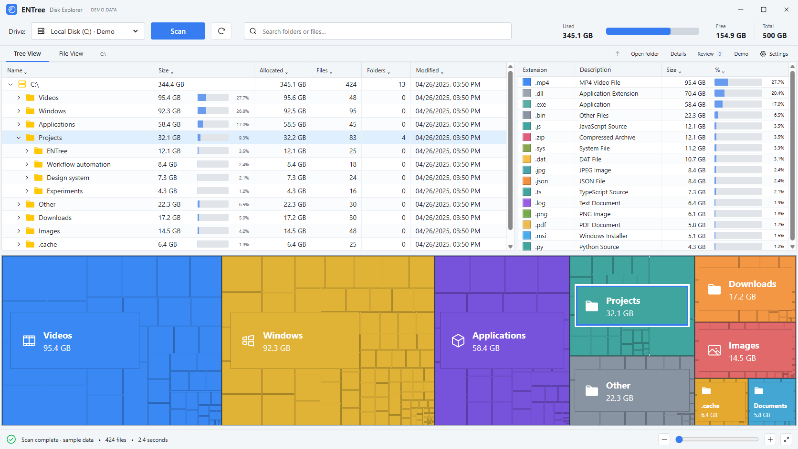

# ENTree

**Your disk, in detail.** A local desktop disk explorer with a nested treemap and a workspace you can make your own.



ENTree is an independent implementation inspired by [tobi/disktree](https://github.com/tobi/disktree). It shares the treemap/navigation/review concept, with original application code and styling. Its light interface follows a user-provided Disk Explorer visual reference; the Settings button includes a personalized forest theme. No upstream code or artwork is bundled. UI icons are [Phosphor Icons](https://github.com/phosphor-icons/core), MIT licensed; their license is included in `src/icons/LICENSE`.

## Run

On Windows, use the portable build when available: unpack the entire `ENTree-win32-x64` folder, then double-click **ENTree.exe**. Keep its supporting files beside the executable. It runs offline without Node.js or a web server.

Requires Node.js 22.12+ and npm. Windows, macOS, and Linux are supported by Electron; this initial version has been verified on Windows.

```sh
git clone https://github.com/kristiankaraivanov-cloud/ENTree.git
cd ENTree
npm ci
npm start
```

The app opens with **clearly labeled sample data**. Click **Open folder** to choose a real folder, or select a detected drive and press **Scan**. A background worker scans without reading file contents. Click a tile or table row to select; right-click or press **Details** for its information and review actions. Double-click a directory to explore. Use breadcrumbs or Up to return.

**Tree View** expands and collapses folders. **File View** lists files beneath the current folder. Click table headings to sort by name, size, allocation, file/folder counts, or modification time. Search filters paths; the extension table shows file-type totals and percentages. Click an extension to filter to that file type. The colored nested treemap shows apparent size, with zoom and Fit controls at the bottom. Large tables show at most 1,500 rows; narrow your search to find a specific item.

## Make it yours

Click **Settings** to adjust:

- Reference light, Forest dark, or the system theme
- Any accent color
- Interface size, 85–120%
- Tile spacing and nesting depth
- Reference, Forest, Ocean, or monochrome colors
- Folder labels and dot-prefixed entries

Appearance updates immediately and persists locally. The dot-entry setting applies on the next scan. Reset defaults restores the original design.

## Review and recycle

Select an item and click **Add to review**, or Ctrl/Cmd-click its tile. Marking a parent absorbs descendant marks so totals are not doubled. **Review marked items** shows each path and permits unmarking or exporting a JSON list. **Move to Trash** asks for a native confirmation showing the paths, then uses the operating system Trash/Recycle Bin and rescans. There is no permanent-delete command.

Roots, home directories, system locations, other user profiles, paths outside the scan, changed files or descendants, and folders with skipped links, excluded entries or incomplete scans are refused. Links and other volumes are not followed. Any failed recycle operation is reported. Always review your selection; caches and build folders are classified by name, not guaranteed disposable.

## Measurement and limits

- Reports **apparent file size**, not physical allocated clusters or a promised amount of reclaimable space. Sparse/compressed/cloud files and deduplicated storage can differ.
- **Allocated** uses Windows `GetCompressedFileSizeW` through Koffi, or POSIX `st_blocks × 512`. Unavailable values show a dash. Folder totals sum file allocation and do not include filesystem metadata or directory overhead. Used/Free/Total refer to the entire volume, not just the scanned folder.
- Hard links are counted once per scan. Ownership is attributed to the first encountered link.
- Symlinks, Windows junctions, and mount boundaries with a different device ID are skipped.
- Windows hidden attributes are not filtered; the optional hidden filter covers dot-prefixed names only.
- Unreadable paths are reported; limits of 250,000 entries and 256 directory levels produce an explicitly partial result. Canceled scans disable native actions until a new scan succeeds.
- Folder recycling checks identity and path components before confirmation and immediately before execution. OS filesystem changes can still race a recycle operation. This is an initial release, not a replacement for backups.
- No administrator elevation, NTFS MFT scan, Git status probing, network access, telemetry, or automatic cleanup.

## Develop

```sh
npm test
npm run check
npm run preview    # http://127.0.0.1:4173 — sample data only
npm run package    # current-platform portable app in dist/
```

The browser preview is a demo only; native folder access and recycling require the desktop app. Koffi is the sole application dependency and supports Windows allocated-size queries. Electron, packaging tools and the icon source are development dependencies. Vendored icons need no runtime dependency. No CDN or remote font is used.

| File | Responsibility |
| --- | --- |
| `src/scanner.cjs` | Worker-based filesystem walk, aggregation, classification and recycle validation |
| `src/main.cjs` | Native window, folder picker, scan lifecycle and OS recycling |
| `src/preload.cjs` | Narrow isolated IPC bridge |
| `src/app.js` | Navigation, weighted treemap, review and persisted adjustments |
| `src/styles.css` | Responsive forest/light interface |
| `test/scanner.test.cjs` | Filesystem aggregation and recycle-boundary regressions |

## License

[MIT](LICENSE). Contributions welcome; see [CONTRIBUTING.md](CONTRIBUTING.md).
